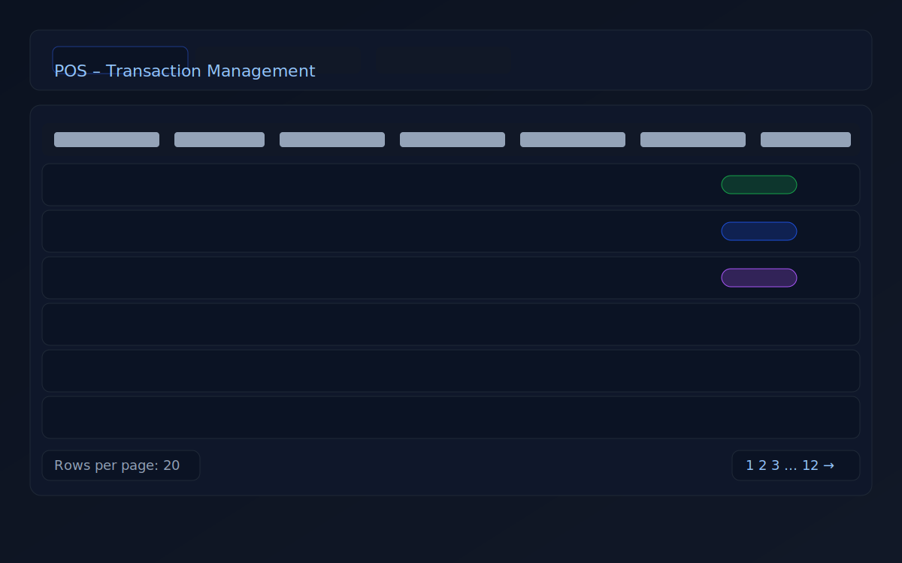
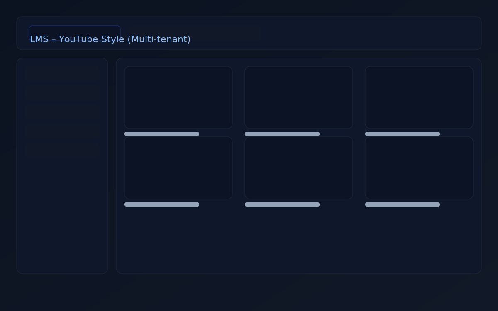

# Yudhi — Frontend Portfolio (Next.js + Tailwind, Dark)

Portofolio pribadi menampilkan proyek nyata:
- **POS – Transaction Management**: tabel transaksi dengan pagination, filter status & metode bayar, date range, modal edit.
- **LMS – YouTube Style (Multi-tenant)**: eksplor multi-tenant (slug/domain) dengan Payload CMS + Docker.

## Tech
Next.js 15 • React • Tailwind v4

## Preview
| POS | LMS |
| --- | --- |
|  |  |

## Jalankan Lokal
```bash
npm i
npm run dev
# buka http://localhost:3000
